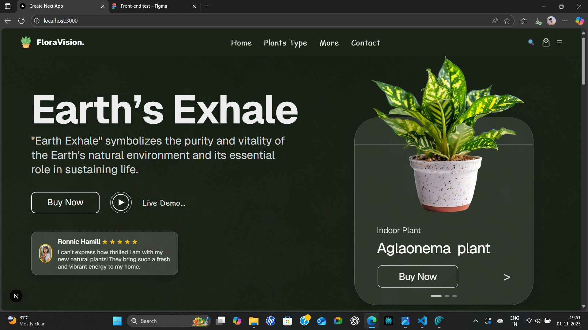

# 🌱 FloraVision Plant Store

A modern, animated, and responsive plant e-commerce web app for discovering, learning about, and buying the world’s best indoor and outdoor plants.

 

---

## 🚀 Live Demo

[🌐 Visit FloraVision (Deployed on Vercel)](https://yourproject.vercel.app)

---

## ✨ Features

- 🪴 Beautiful Hero and Plant Listing Sections with animated scroll reveals
- 🏆 Top-selling, trending & air-purifying (O2) plant highlights
- 🎨 Modern UI with smooth framer-motion transitions and bounce effects
- ⭐ Real customer reviews, interactive buttons, and mobile-first responsive layout
- 🌗 Light/dark glassmorphism design and easy navigation
- 🔒 TypeScript, Tailwind, Next.js 14+, perfect component structure
- ⚡ Blazing fast, optimized for web and mobile

---

## 📸 Demo Screens

| Hero Section | Trendy Plants | O2 Section | Top Sellers |
|--------------|--------------|------------|-------------|
|  |  |  |  |

---

## 🛠️ Tech Stack

- **Framework**: Next.js 14+, React 18+
- **Styling**: Tailwind CSS, custom utility classes
- **Animation**: Framer Motion (scroll, bounce, reveal)
- **Deployment**: Vercel
- **Design Reference**: Figma (custom spec UI)

---

## 📦 Local Setup

1. Clone the repository
git clone https://github.com/yourname/your-plantstore.git
cd your-plantstore

2. Install dependencies
npm install

3. Start the development server
npm run dev

4. Open your browser and visit
http://localhost:3000

text

---

## 🏗️ Project Structure

/
├── components/ # Reusable React components (Navbar, HeroBanner, PlantCard, etc)
├── public/assets/ # Images, logos, plant icons
├── pages/ or app/ # Next.js routing (appDir if Next.js 13+)
├── styles/ # Tailwind & global styles
├── README.md
├── package.json
└── ...

text

---

## 🙌 Credits

- Designed and Developed by [Manoj S](https://github.com/manojmanvy)
- Plant images: Custom/Unsplash/Flaticon (as per your asset source)
- UI: Inspired by modern eComm and Figma concepts

---

## 📮 Contact & Feedback

Questions, suggestions, or want to collaborate?  
Open an issue or reach me on [LinkedIn](https://www.linkedin.com/in/manoj-sundarrajan-756a36346).

---

> _"From lush indoor greens to vibrant outdoor blooms, our plants are crafted to thrive and elevate your living environment."_

---


This is a [Next.js](https://nextjs.org) project bootstrapped with [`create-next-app`](https://nextjs.org/docs/app/api-reference/cli/create-next-app).

## Getting Started

First, run the development server:

```bash
npm run dev
# or
yarn dev
# or
pnpm dev
# or
bun dev
```

Open [http://localhost:3000](http://localhost:3000) with your browser to see the result.

You can start editing the page by modifying `app/page.tsx`. The page auto-updates as you edit the file.

This project uses [`next/font`](https://nextjs.org/docs/app/building-your-application/optimizing/fonts) to automatically optimize and load [Geist](https://vercel.com/font), a new font family for Vercel.

## Learn More

To learn more about Next.js, take a look at the following resources:

- [Next.js Documentation](https://nextjs.org/docs) - learn about Next.js features and API.
- [Learn Next.js](https://nextjs.org/learn) - an interactive Next.js tutorial.

You can check out [the Next.js GitHub repository](https://github.com/vercel/next.js) - your feedback and contributions are welcome!

## Deploy on Vercel

The easiest way to deploy your Next.js app is to use the [Vercel Platform](https://vercel.com/new?utm_medium=default-template&filter=next.js&utm_source=create-next-app&utm_campaign=create-next-app-readme) from the creators of Next.js.

Check out our [Next.js deployment documentation](https://nextjs.org/docs/app/building-your-application/deploying) for more details.
